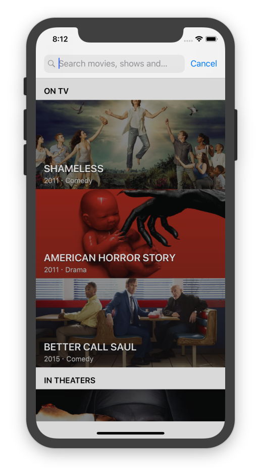
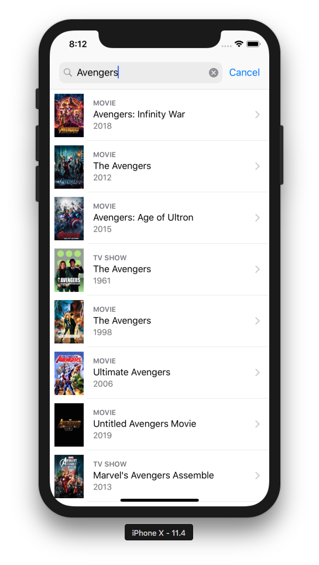
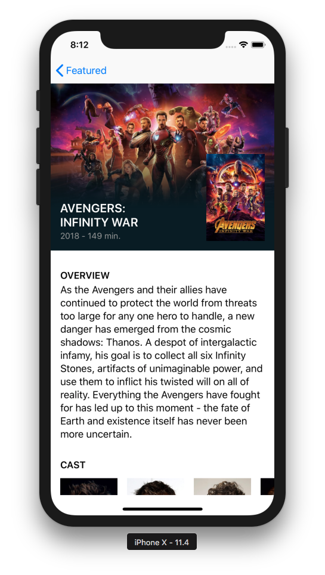
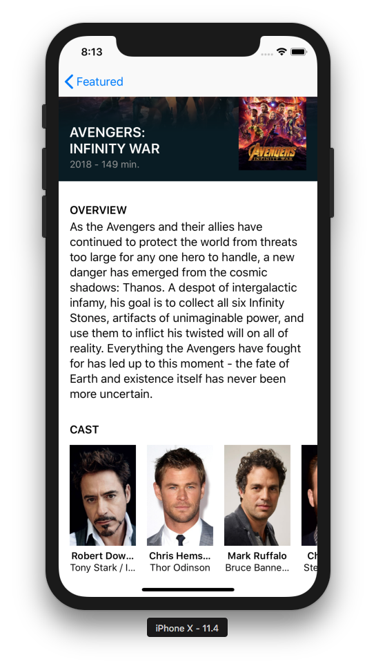
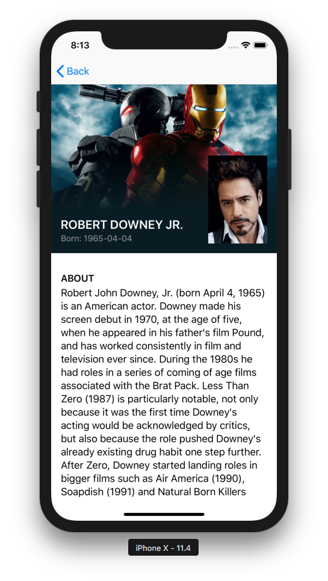

# Práctica Superpoderes iOS con Swift/MVP/RxSwift Boot VI (2018)
## Por Brais Moure Morais

Aplicación iOS en Swift nutrida con servicios de TMDb. Explora películas, series y actores.

## Importante
* Instalar las dependencias del proyecto usando Carthage.
* Para el correcto funcionamiento de la app contra el API de TMDb, debemos crear en la ruta `TMDbCore/Config` un fichero `llamado Keys.xcconfig` que contenga:

	`TMDB_API_KEY = [NUESTRA API KEY DE TMDB]`

## Requisitos
* Xcode 9.4 ([https://developer.apple.com/xcode/](https://developer.apple.com/xcode/))
* Swift 4
* iOS 11.x o superior
* Carthage ([https://github.com/Carthage/Carthage](https://github.com/Carthage/Carthage))

## Preview

### Autor
*Brais Moure Morais. © 2017-2018*